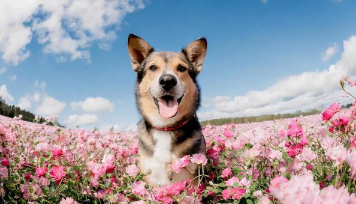
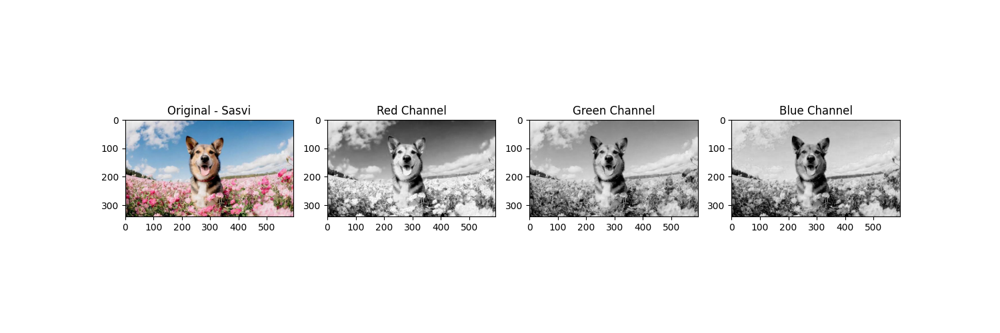
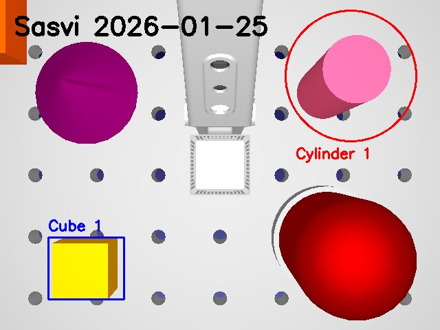

# Machine Vision - Assignment 1

### Student
- Sasvi Vidunadi Ranasinghe, sasvi23, amk1005778@student.hamk.fi

## Summary
This repository describes the activities and tasks related to **OpenCV** and **RoboDK** image annotation in the course Machine Vision of the Degree program ICT and Robotics at Häme University of Applied Sciences. 

---

## 2026-01-25

**Assignment by:**
- Sasvi Vidunadi Ranasinghe

### Image Processing and Annotation
I have completed the image annotation tasks using Python and OpenCV according to the instructions given in the assignment.

- Set up a Python environment and installed necessary libraries via `pip`.
- Created `task-a.py` to process a 4-image grid and overlay student identification.
- Created `task-b2.py` to annotate a specific snapshot from the RoboDK robot simulation environment.
- Configured precise geometric frames for specific objects:
    - **Cube 1**: Annotated with a blue rectangle tightly fitted to the object edges.
    - **Cylinder 1**: Annotated with a red circle highlighting the top profile.
- Generated a `requirements.txt` file using `pip freeze` to ensure environment reproducibility.

### Findings
- **Ease/Difficulty:** The logic of using OpenCV was straightforward, however, fine-tuning the `cv2.rectangle` and `cv2.circle` coordinates to fit the objects perfectly required multiple iterations to achieve high precision.
- **Time/Speed:** The entire process took approximately 5-6 hours including intervals. Once the scripts are configured, the execution is nearly instantaneous.
- **Issues:** During the process, the RoboDK application experienced frequent crashes while attempting to capture snapshots, which required restarting the simulation environment several times to obtain the final image. Additionally, I ensured `cv2.waitKey(0)` was correctly implemented so the program windows could be closed manually.

### Deliverables and Execution
The instructor can run exactly the following script to verify the assignment:

```bash
git clone [https://github.com/sasvi23/Machine-Vision.git](https://github.com/sasvi23/Machine-Vision.git)
cd Machine-Vision
python -m venv assign1
source assign1/Scripts/activate  
pip install -r requirements.txt
python task-a.py
python task-b2.py
deactivate
```


---

## Results

### Task A: Grid Annotation
I processed the original 4-image grid and added identification overlays.

**Original Image:**
<br />

**Annotated Result:**
<br />

---

### Task B2: RoboDK Snapshot Annotation
The following image shows the objects in the RoboDK environment framed with precise geometric shapes and labels.

**Final Annotated Snapshot:**
<br />