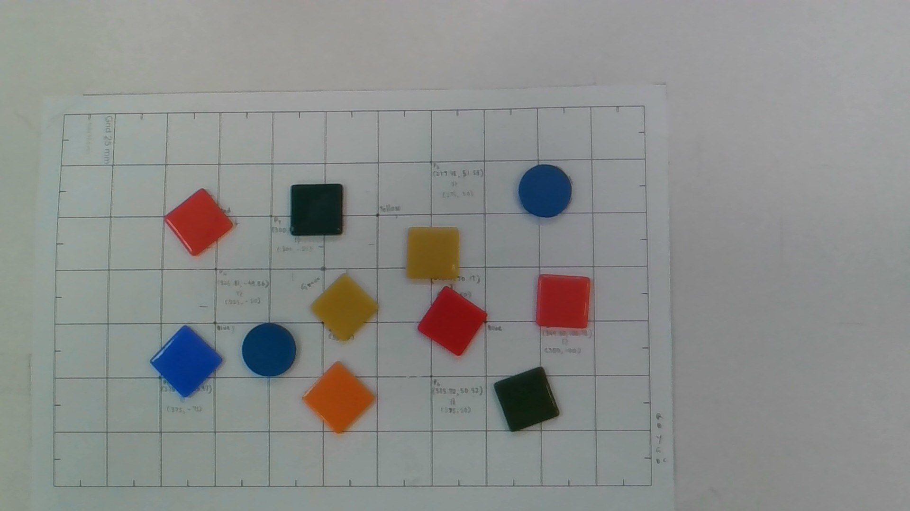
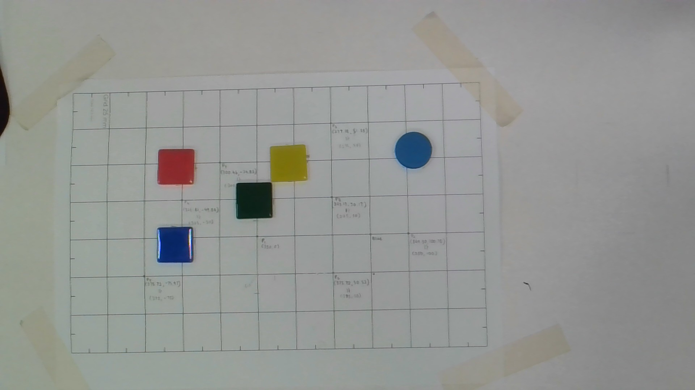

# Machine Vision – Final Project: Integrated Vision-Guided Robotic Pick-and-Place System

### **ProjectGroup 12**

### Team Members
- Udalmaththa Gamage Chathuri Anuththara Karunarathna, amk1004058@student.hamk.fi
- Sasvi Vidunadi Ranasinghe, sasvi23, amk1005778@student.hamk.fi
- Himihami Mudiyanselage Lahiru Bandaranayake, amk1004101@student.hamk.fi


---

## Summary

This repository contains the full implementation of a vision-guided robotic pick-and-place system using **Python**, **OpenCV**, and **Streamlit**, developed as the final project for the Machine Vision course (IR00EU71-3001) at HAMK. The system uses a fixed overhead camera to detect coloured objects on a table, maps their pixel positions to robot workspace coordinates using a homography calibration, and commands a **Dobot MG400** robot arm to pick and place them sequentially.

The project implements the complete pipeline: camera calibration, HSV-based colour and shape detection, pixel-to-robot coordinate transformation, and robot execution, accessible via both a command-line interface (CLI) and a Streamlit graphical user interface (GUI).

---

## Project Goal

The core objective was to build a system that can:

1. **Calibrate** a real camera to the robot workplane and save the calibration to a file
2. **Detect** objects from a camera image using colour and shape filters
3. **Convert** each detected object's pixel centre `(u, v)` into robot coordinates `(X, Y)` using the calibration homography
4. **Operate** in two modes:
   - **Plan mode:** compute and display target coordinates only — robot does not move
   - **Execute mode:** run the full pick-and-place sequence on the robot

---

## Repository Structure
```
Machine_Vision/
├── app_streamlit.py          # Streamlit GUI entry point
├── main.py                   # CLI entry point
├── run_ui.py                 # Quick-start launcher for Streamlit
├── requirements.txt          # Python dependencies
├── calibration.json          # Saved homography calibration
├── IMAGE.jpg                 # Sample scene image (used for testing)
├── IMAGE1.jpg                # Clean five-object scene image
├── dobot_api.py              # Dobot MG400 TCP/IP API wrapper
├── vision/
│   ├── __init__.py
│   └── detect.py             # Object detection module
├── robot/
│   ├── __init__.py
│   ├── robot_control.py      # Pick-and-place motion sequencing
│   └── dobot_controller.py   # Robot communication layer
├── calibration/
│   └── calibrate.py          # Calibration tool
└── outputs/                  # Annotated output images (generated)
```

---


## System Architecture

The system is divided into four independent modules. Each module can be developed and tested in isolation, which was important during development as it allowed the vision pipeline to be tested on any laptop without requiring the robot to be connected.
```
Camera / Image 
      |
calibration/calibrate.py   ->   calibration.json (H matrix)
      |
vision/detect.py           ->  detected objects [{pixel_center, color, shape}]
      |
main.py / app_streamlit.py ->  robot coordinates (X, Y) via H
      |
robot/robot_control.py     ->  Dobot MG400 pick-and-place
      |
dobot_api.py               ->  TCP/IP commands to hardware
```

---

## 1. Calibration

### Overview

Calibration establishes the geometric relationship between camera image pixels and the physical robot workspace. Because the camera is mounted at a fixed angle overhead and the table is a flat plane, a **homography** (projective transformation) is the exact mathematical model for this mapping — no approximation is needed.

The calibration tool (`calibration/calibrate.py`) works as follows:

1. Load a saved image or capture from the live camera
2. The user clicks at least **4 points** on the image that correspond to known physical positions on the table
3. For each clicked pixel `(u, v)`, the user enters the corresponding robot coordinate `(X, Y)` measured manually on the table surface
4. OpenCV's `cv2.findHomography` computes the 3×3 matrix **H** from these correspondences
5. H and the image resolution are saved to `calibration.json`


### Calibration File
```json
{
    "H": [
        [-0.05735165466422766, 0.301216558072551, 195.0597561128266],
        [0.23250608930629185, -0.00217295410566623, -168.09103779792073],
        [-0.00017030901032571443, 0.00018366905241841997, 1.0]
    ],
    "image_width": 1920,
    "image_height": 1080,
    "date": "2026-03-02 09:35:48.449666",
    "notes": "Calibration from saved image with 4 points"
}
```

### Pixel-to-Robot Transformation

A pixel point is transformed using:
```
p = [u, v, 1]ᵀ
q = H · p
X = q[0] / q[2]
Y = q[1] / q[2]
```

Implemented in both `main.py` and `app_streamlit.py`:
```python
def pixel_to_robot(x_pixel, y_pixel, H):
    pixel_point = np.array([x_pixel, y_pixel, 1.0], dtype=np.float32)
    robot_point_h = H @ pixel_point
    robot_x = robot_point_h[0] / robot_point_h[2]
    robot_y = robot_point_h[1] / robot_point_h[2]
    return float(robot_x), float(robot_y)
```

The calibration used in this project was performed at **1920×1080** resolution. The valid robot workspace is:

| Axis | Min (mm) | Max (mm) |
|------|----------|----------|
| X    | -50      | 380      |
| Y    | -100     | 380      |

Any detected object whose mapped coordinates fall outside these bounds is discarded before any pick command is issued.

---

## 2. Object Detection

### Overview

Detection is implemented in `vision/detect.py`. The pipeline converts the input frame from BGR to **HSV colour space**, which separates hue (colour) from saturation and brightness. This makes the detector significantly more robust to lighting variations compared to working in BGR directly, because a change in lighting intensity affects V (value) but not H (hue).

### Colour Segmentation

We started development with colour detection first, tuning HSV ranges against the specific acrylic tiles used in the lab before adding shape classification. The defined colour ranges are:

| Colour | HSV Lower | HSV Upper | Notes |
|--------|-----------|-----------|-------|
| Red (1) | [0, 150, 50] | [10, 255, 255] | Lower red hue band |
| Red (2) | [160, 100, 100] | [180, 255, 255] | Upper red hue band (hue wraps at 180°) |
| Green | [35, 50, 10] | [85, 255, 255] | Standard green range |
| Blue | [90, 100, 50] | [140, 255, 255] | Standard blue range |
| Yellow | [20, 100, 100] | [35, 255, 255] | Yellow-orange hue band |

Red requires two separate bands because OpenCV's HSV hue scale runs from 0–180°, and red spans both the 0° end and the 180° end of the wheel. Both masks are combined with a bitwise OR before processing.

### Shape Classification

After colour masking, morphological erosion followed by dilation removes noise from the binary mask. Contours are then extracted and each is classified by its **circularity**:
```
circularity = (4π × Area) / Perimeter²
```

- **Circle:** circularity > 0.80
- **Square:** circularity ≤ 0.80

Contours with a bounding box smaller than 30×30 pixels are discarded to eliminate reflections, dust, and other small artefacts.

For each valid contour, the pixel centroid `(u, v)` is computed using image moments:
```python
M = cv2.moments(contour)
cx = int(M['m10'] / M['m00'])
cy = int(M['m01'] / M['m00'])
```

### Detection Output

Each detected object returns:
```python
{
    "pixel_center": (u, v),
    "color": "red" | "green" | "blue" | "yellow",
    "Shape": "circle" | "square"
}
```

---

## 3. CLI – Command-Line Interface (`main.py`)

### Overview

The CLI is the primary entry point for scripted or automated operation. It loads the calibration, captures or loads an image, runs detection, maps coordinates, and either prints results (Plan mode) or commands the robot (Execute mode).

### Arguments

| Argument | Type | Default | Description |
|----------|------|---------|-------------|
| `--mode` | `plan` / `execute` | `plan` | Operating mode |
| `--color` | string | `any` | Colour filter: `red`, `green`, `blue`, `yellow`, or `any` |
| `--shape` | string | `any` | Shape filter: `circle`, `square`, or `any` |
| `--camera` | int | `0` | Camera device index |
| `--width` | int | `640` | Capture width in pixels |
| `--height` | int | `480` | Capture height in pixels |
| `--image` | string | `None` | Path to a pre-saved image file |

### The `--image` Parameter

Initially the system relied entirely on live camera capture. During testing we found that the camera requires time to initialise and auto-adjust exposure before producing a stable, well-exposed frame. This added a delay to every test run. To solve this, we added the `--image` parameter which allows a pre-saved image to be passed directly, bypassing camera initialisation entirely.

**If `--image` is not provided, live camera capture is used as the default.** In both cases, the frame is automatically resized to match the calibration resolution (1920×1080) before detection runs, ensuring the homography matrix is always applied at the correct scale.

### Usage Examples
```bash
# Detect all objects, plan only (default)
python main.py

# Detect all objects with live camera, plan only
python main.py --mode plan

# Detect red squares from a saved image, plan only
python main.py --mode plan --color red --shape square --image IMAGE.jpg

# Detect blue objects from a saved image and execute picks
python main.py --mode execute --color blue --image IMAGE1.jpg

# Detect all circles from live camera and execute picks
python main.py --mode execute --shape circle

# Use a different camera at higher resolution
python main.py --mode plan --camera 1 --width 1920 --height 1080
```

### Plan Mode Output

In Plan mode, the CLI prints the homography matrix, calibration resolution, each detected object with its pixel centre and mapped robot coordinates, and a workspace validation result. No motion commands are sent to the robot. An annotated overlay image is saved to `outputs/`.
```
--- Vision-to-Robot Pipeline Started ---
Loaded homography matrix:
[[-0.0574  0.3012  195.06]
 [ 0.2325 -0.0022 -168.09]
 [-0.0002  0.0002    1.00]]
Calibration resolution: 1920 x 1080
Detected 5 matching objects.
Pixel (370, 340) -> Robot (128.3, 93.1)
Pixel (605, 320) -> Robot (203.4, 87.2)
...
Selected Red Square at pixel (370, 340) → Robot (128.30, 93.10)
Plan mode: Robot motion not executed.
```

### Execute Mode

Execute mode runs the identical pipeline and then calls `execute_pick_and_place()` for each validated target. Objects are processed **sequentially** in detection order.
```bash
python main.py --mode execute --color red --image IMAGE.jpg
```

>  **Safety:** Always test in Plan mode first to verify coordinates before switching to Execute mode.

---

## 4. Streamlit GUI (`app_streamlit.py`)

### Launching the GUI
```bash
# Option A: Direct
streamlit run app_streamlit.py

# Option B: Quick-start script (checks dependencies and calibration first)
python run_ui.py
```

The app opens at `http://localhost:8501`.

### Interface Overview

The GUI provides the same full pipeline as the CLI through a browser-based interface. It is intended for use by a factory operator who needs clear visual feedback at each step.

**Screenshots:**


*Figure 1 – Streamlit GUI: sidebar configuration with colour filter set to red, shape filter set to square, Plan mode active. Results panel shows 3 red square targets detected and confirmed in workspace.*


*Figure 2 – Streamlit GUI: annotated detection image with centroid markers. Each target shows colour, shape, and computed robot (X, Y) coordinates.*

### Sidebar Controls

| Control | Description |
|---------|-------------|
| **Plan / Execute** buttons | Toggle operating mode. Execute mode shows a prominent warning banner. |
| **Color** dropdown | Filter: `any`, `red`, `green`, `blue`, `yellow` |
| **Shape** dropdown | Filter: `any`, `circle`, `square` |
| **Reload Calibration** | Hot-reload `calibration.json` without restarting the app |
| **Camera ID** | Integer input for camera device index (default: 0) |
| **Width / Height** | Camera capture resolution (default: 640×480) |
| **Motion speed (%)** | Slider: robot movement speed ratio (10–100%) |
| **Acceleration (%)** | Slider: robot acceleration ratio (10–100%) |
| **Gripper delay (s)** | Slider: pause after gripper open/close (0.1–2.0 s) |

### Main Area Buttons

| Button | Behaviour |
|--------|-----------|
| **Capture / Refresh** | Loads `IMAGE.jpg` if present in project directory; otherwise captures from camera. Auto-resizes to calibration resolution. |
| **Detect Target** | Runs the full vision pipeline with active colour/shape filters. Displays annotated overlay. |
| **Run Pick** | **Disabled in Plan mode.** In Execute mode, triggers the robot pick-and-place sequence for all valid targets. |

### Results Panel

Each detected target appears in an expandable panel:
```
▼ Target 1: Red Square
   Pixel (u, v)    Robot (X, Y)
   (370, 340)      (128.3, 93.1)
   ✓ In workspace
```

Workspace limits are also displayed for reference:
```
X: [-50, 380]
Y: [-100, 380]
```

### Plan vs Execute Mode

| | Plan Mode | Execute Mode |
|--|-----------|--------------|
| Detection | Done | Done |
| Coordinate mapping | Done | Done |
| Annotated overlay | Done | Done |
| Robot movement | - | Done |
| Run Pick button | Disabled | Enabled |
| Warning banner | None |  Active |

Plan mode is the **default** and is designed for testing and verifying detection results before committing to robot motion. This is the recommended workflow: always run Plan first, verify all coordinates look correct, then switch to Execute.

---

## 5. Robot Control

### Pick-and-Place Sequence

The robot control layer (`robot/robot_control.py`) wraps the official Dobot TCP/IP Python API (`dobot_api.py`). For each validated target the following sequence is executed:

| Step | Action | Height / Position |
|------|--------|-------------------|
| 1 | Move above target | SAFE_Z = 50 mm |
| 2 | Lower to pick height | PICK_Z = −169 mm |
| 3 | Close gripper | Digital output DO1 = 1 |
| 4 | Lift to safe height | SAFE_Z = 50 mm |
| 5 | Move to drop zone | DROP_X = 325, DROP_Y = 235 |
| 6 | Lower to drop height | DROP_Z = −79 mm |
| 7 | Open gripper | Digital output DO1 = 0 |
| 8 | Return to home | Ready position |

All targets in a session are picked **sequentially**. Speed ratio, acceleration ratio, and gripper delay are configurable via the GUI sidebar sliders.

### Robot Communication

Communication with the Dobot MG400 uses the official TCP/IP protocol. The default robot IP address is `192.168.1.6`. The `dobot_api.py` module handles socket connections, command formatting, and the feedback data structure for robot state monitoring.

---

## 6. System Operation

### Physical Setup

Coloured acrylic tiles are placed on a 25 mm grid reference sheet within the robot workspace. The grid sheet also serves as the calibration reference — the printed grid intersections provide known physical coordinates for the calibration step.



*Figure 3 – Full test scene: multiple coloured tiles (red, blue, yellow, green squares; blue and orange circles) arranged on the 25 mm grid calibration sheet.*



*Figure 4 – Clean five-object detection run: red square, yellow square, green square, blue square, and blue circle.*

### Example Detection Results

The table below shows an example Plan mode run on the scene in Figure 4, with no colour or shape filter applied (detect all):

| Object | Colour | Shape | Pixel (u, v) | Robot (X, Y) mm | Workspace |
|--------|--------|-------|--------------|-----------------|-----------|
| 1 | Red    | Square | (370, 340) | (128, 93)  | ✓ Valid |
| 2 | Yellow | Square | (605, 320) | (203, 87)  | ✓ Valid |
| 3 | Green  | Square | (530, 420) | (177, 128) | ✓ Valid |
| 4 | Blue   | Square | (370, 510) | (126, 163) | ✓ Valid |
| 5 | Blue   | Circle | (865, 305) | (301, 82)  | ✓ Valid |

All five objects fell within the valid workspace and were successfully picked and placed in Execute mode.

### Recommended Workflow
```
1. Run calibration (once per physical setup)
   python main.py --mode plan --image IMAGE.jpg
   → verify calibration.json is present

2. Test detection in Plan mode
   python main.py --mode plan --color red --shape square --image IMAGE.jpg
   → verify pixel and robot coordinates look correct

3. Launch GUI for interactive operation
   streamlit run app_streamlit.py

4. In GUI: set filters -> Capture / Refresh → Detect Target → review results

5. Switch to Execute mode -> Run Pick
   -> robot performs pick-and-place for all valid targets
```

---

## 7. Discussion

### Development Process

We started development with **colour detection**, building and tuning the HSV segmentation pipeline first before adding shape classification and the rest of the system. This was a deliberate choice, colour detection is the foundation everything else depends on, and it needed to be reliable before we could verify that coordinate mapping and robot control were behaving correctly.

Once the core vision pipeline was stable, coordinate mapping was straightforward: a single matrix multiplication per detected centroid. Robot control required more careful work due to TCP/IP connection timing and the Dobot command queue, but the modular structure meant we could test the vision and mapping code on any laptop independently before connecting the robot.

The Streamlit GUI was built with AI assistance after the core pipeline was complete. Using AI for the frontend significantly reduced development time on the UI layer and allowed us to focus effort on the parts of the system that required domain knowledge: HSV tuning, calibration accuracy, and robot motion parameters.

### Challenges

**HSV colour tuning** was the most iterative part of the project. The lab fluorescent lighting produced colours on the tiles that differed from standard HSV textbook values. Yellow in particular edged into the orange range and required the upper hue boundary to be adjusted after live testing. Red required two separate hue bands because the OpenCV HSV scale wraps at 180°.

**Camera warm-up delay** was an unexpected practical issue. The camera takes time to initialise and stabilise its auto-exposure before producing a usable frame. This added a noticeable delay to every test run during development. The solution was adding the `--image` parameter so pre-saved images could be used directly, which made the development iteration cycle much faster.

**Dobot TCP/IP timing** required careful handling of the connection sequence and command queue. The robot must be in a ready state before motion commands are accepted, and issuing commands too quickly can cause them to be dropped.

### Performance

| Operation | Time |
|-----------|------|
| Image capture (camera) | 300–500 ms |
| Image load (file) | <50 ms |
| Detection (HSV + contours) | <200 ms per frame |
| Coordinate mapping | <5 ms |
| Robot pick-and-place (per object) | 3–5 seconds at 50% speed |
| Full 5-object sequence | ~20–25 seconds |

### Potential Improvements

- **Deep-learning detection:** Replacing HSV thresholding with a small YOLO model (e.g. YOLOv8n) would handle occlusion, non-saturated colours, and varied lighting far better without manual HSV tuning.
- **Rotation-aware grasping:** The current system picks at a fixed gripper rotation. Detecting each object's principal axis and aligning the gripper accordingly would improve grasp reliability, particularly for tiles placed at an angle.
- **Automatic exposure compensation:** Locking or programmatically setting camera exposure would remove the need to re-tune HSV ranges when lighting conditions change.
- **Post-pick verification:** A second image capture after each pick could confirm the object was successfully removed and trigger a retry if not.
- **Continuous live preview:** Streaming detection in the GUI would give operators real-time situational awareness rather than the current single-shot capture model.

---

## Discussion Questions (Assignment)

### How easy was it?

The modular structure made the project manageable. Because each module could be tested independently, we were rarely blocked, if the robot was unavailable, we could still work on vision; if the camera was unavailable, we could test with saved images. The hardest single task was tuning HSV ranges for our specific tiles and lighting, which required multiple rounds of live testing and adjustment.

### How long did it take?

Development was spread across approximately three weeks with an estimated 45–55 person-hours across the three team members. The calibration tool and vision pipeline required the most iteration time. Robot integration was the most technically complex due to the TCP/IP communication layer.

### How fast does it complete the operation?

Detection runs in under 200 ms per frame. A complete five-object pick-and-place sequence takes approximately 20–25 seconds at default 50% speed and acceleration settings. Individual object cycle time is 3–5 seconds depending on travel distance.

### What could be improved?

See Potential Improvements section above. The most impactful single change would be replacing HSV thresholding with a learned detector, which would remove the manual tuning dependency and make the system robust to lighting changes and a wider variety of objects.

---

## Bonus Features Implemented

| Feature | Points | Status |
|---------|--------|--------|
| Colour filter (`--color red`, etc.) | +10% | Implemented |
| Shape filter (`--shape circle`, etc.) | +10% |Implemented |
| Combined colour + shape logic | +5% |  Implemented |

---
